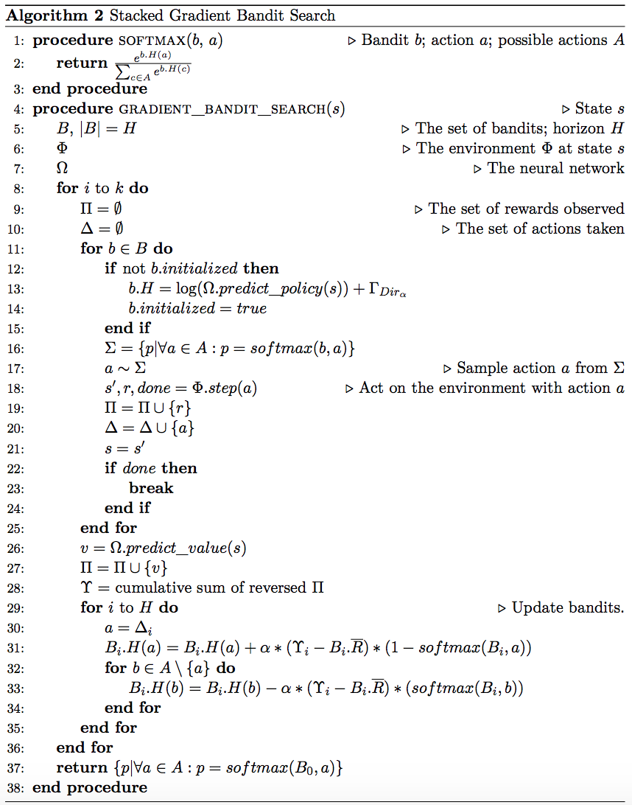
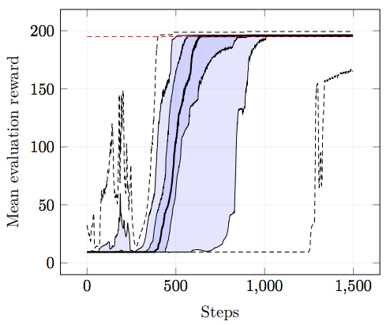

Based on [bootleg AlphaZero](https://github.com/instance01/BootlegAlphaZero).

This repository implements GRAB0 with two approaches - GBTS (Gradient Bandit
Tree Search), which is MCTS but with Gradient Bandits, and SGBS (Stacked
Gradient Bandit Search) with a stack of Gradient Bandits.

Below is SGBS in a nutshell:

 

Experimental results for GRAB0 can be found in
[results.md](https://github.com/instance01/GRAB0/blob/master/results.md). There
are a few more that are currently not pushed yet, more information will follow
here.

Below is the result of training 33 runs on Cartpole using the GRAB0 approach in
combination with SGBS.

 

### Installation

Information will follow.
