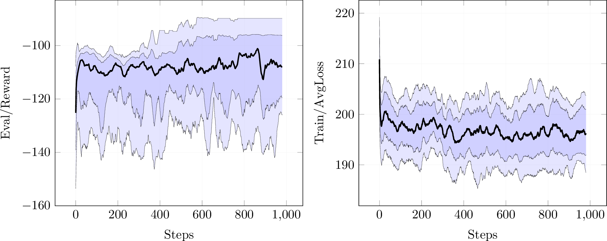

Based on [bootleg AlphaZero](https://github.com/instance01/BootlegAlphaZero).
More information will follow.

Below is the result of training 10 times on MountainCar using bootleg AlphaZero with parameter configuration 127. More current configurations can be seen [here](https://github.com/instance01/BootlegAlphaZero/blob/master/alphazero/cpp_impl/results.md).

 

Experiment results for GRAB0 can be found in [results.md](https://github.com/instance01/GRAB0/blob/master/results.md).
